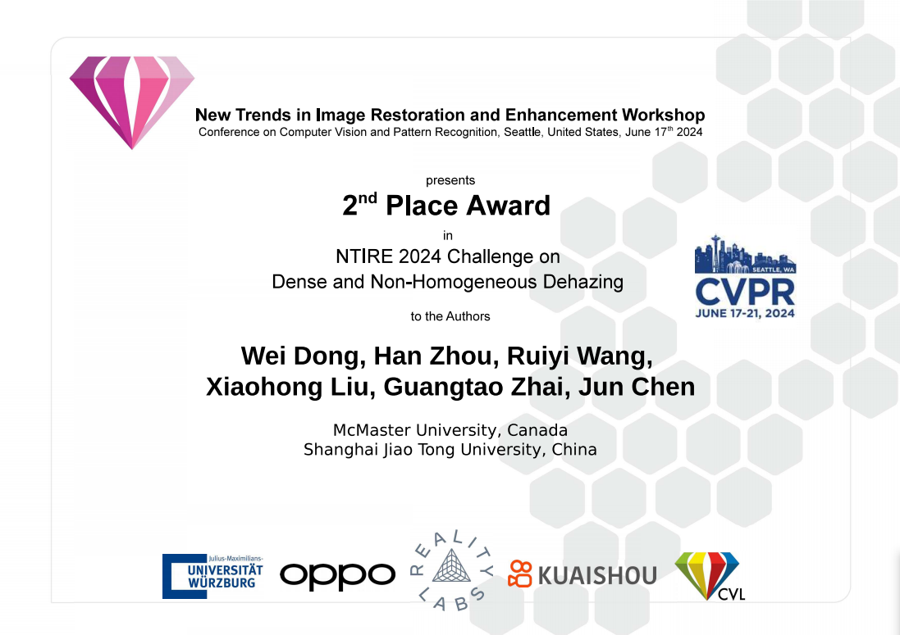
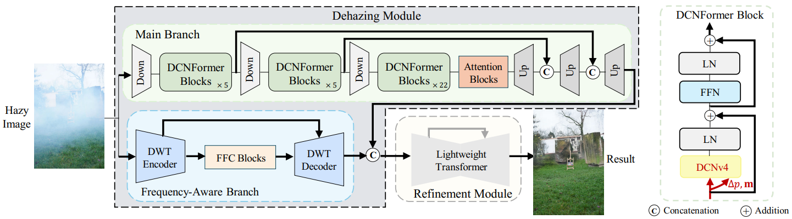

&nbsp;

<div align="center">
<p align="center">  </p>


[](https://openaccess.thecvf.com/content/CVPR2024W/NTIRE/papers/Dong_DehazeDCT_Towards_Effective_Non-Homogeneous_Dehazing_via_Deformable_Convolutional_Transformer_CVPRW_2024_paper.pdf)
[](https://codalab.lisn.upsaclay.fr/competitions/17529#results)

[](https://paperswithcode.com/sota/nonhomogeneous-image-dehazing-on-dnh-haze?p=dehazedct-towards-effective-non-homogeneous)
[](https://paperswithcode.com/sota/single-image-dehazing-on-dnh-haze?p=dehazedct-towards-effective-non-homogeneous)
[](https://paperswithcode.com/sota/image-dehazing-on-dnh-haze?p=dehazedct-towards-effective-non-homogeneous)
[](https://paperswithcode.com/sota/nonhomogeneous-image-dehazing-on-hd-nh-haze?p=dehazedct-towards-effective-non-homogeneous)
[](https://paperswithcode.com/sota/single-image-dehazing-on-hd-nh-haze?p=dehazedct-towards-effective-non-homogeneous)
[](https://paperswithcode.com/sota/image-dehazing-on-hd-nh-haze?p=dehazedct-towards-effective-non-homogeneous)
[](https://paperswithcode.com/sota/nonhomogeneous-image-dehazing-on-nh-haze-2?p=dehazedct-towards-effective-non-homogeneous)
[](https://paperswithcode.com/sota/single-image-dehazing-on-nh-haze?p=dehazedct-towards-effective-non-homogeneous)
[](https://paperswithcode.com/sota/nonhomogeneous-image-dehazing-on-nh-haze2?p=dehazedct-towards-effective-non-homogeneous)
[](https://paperswithcode.com/sota/image-dehazing-on-nh-haze2?p=dehazedct-towards-effective-non-homogeneous)
[](https://paperswithcode.com/sota/single-image-dehazing-on-nh-haze2?p=dehazedct-towards-effective-non-homogeneous)
[](https://paperswithcode.com/sota/nonhomogeneous-image-dehazing-on-nh-haze?p=dehazedct-towards-effective-non-homogeneous)


</div>
&nbsp;


### Introduction
This is the official PyTorch implementation of **DehazeDCT: Towards Effective Non-Homogeneous Dehazing via Deformable Convolutional Transformer** in CVPRW 2024. Our DehazeDCT **won the second place** in the [NTIRE 2024 Dense and Non-Homogeneous Dehazing Challenge]([https://codalab.lisn.upsaclay.fr/competitions/17546](https://codalab.lisn.upsaclay.fr/competitions/17529)). If you find this repo useful, please give it a star ⭐ and consider citing our paper in your research. Thank you.

### NTIRE 2024 Award


### Overall Framework



### Results
<details close>
<summary><b>Performance on NH-HAZE, NH-HAZE2, HD-NH-HAZE, and DNH-HAZE:</b></summary>


</details>

<details close>
<summary><b>Rank of NTIRE 2024 Dense and Non-Homogeneous Dehazing Challenge:</b></summary>


</details>

<details close>
<summary><b>Result of DehazeDCT for NTIRE 2024 Dense and Non-Homogeneous Dehazing Challenge Test Data:</b></summary>


</details>


### Create Environment
#### Dependencies and Installation
- Python 3.8
- Pytorch 1.11

1. Create Conda Environment
```
conda create --name dehazedct python=3.8
conda activate dehazedct
```

2. Install Dependencies
```
conda install pytorch=1.11 torchvision cudatoolkit=11.3 -c pytorch
pip install -U openmim
mim install mmcv-full==1.5.0
pip install timm==0.6.11 mmdet==2.28.1
pip install opencv-python termcolor yacs pyyaml scipy
pip install DCNv4==latest
pip install numpy matplotlib scikit-learn scikit-image timm kornia einops pytorch_lightning
```


### Datasets
NH-HAZE [NTIRE 2020](https://data.vision.ee.ethz.ch/cvl/ntire20/nh-haze/) 

NH-HAZE2 [NTIRE 2021](https://competitions.codalab.org/competitions/28032#participate) 

HD-NH-HAZE [NTIRE 2023](https://codalab.lisn.upsaclay.fr/competitions/10216#participate)

DNH-HAZE [NTIRE 2024](https://codalab.lisn.upsaclay.fr/competitions/17529#participate)


### Pre-trained Model
- [NTIRE 2024 Dense and Non-Homogeneous Dehazing Challenge](https://drive.google.com/file/d/17cV2VeKXp2dFfMaTwdWTdfKqWQUs7g8f/view?usp=drive_link).

### Testing
Download above saved models and unzip it into the folder ./weights. To test the model, you need to specify the test dictionary (Line 17 in test.py) and model path (Line 41 in test.py and Line 19 in model.py). Then run
```bash
python test.py 
```
You can check the output in `../results`.


### Citation
If you find our work useful for your research, please consider citing our paper

```shell
@InProceedings{dehazedct_2024_cvprw,
    author    = {Dong, Wei and Zhou, Han and Wang, Ruiyi and Liu, Xiaohong and Zhai, Guangtao and Chen, Jun},
    title     = {DehazeDCT: Towards Effective Non-Homogeneous Dehazing via Deformable Convolutional Transformer},
    booktitle = {Proceedings of the IEEE/CVF Conference on Computer Vision and Pattern Recognition (CVPR) Workshops},
    month     = {June},
    year      = {2024},
    pages     = {6405-6414}
}
```

### Contact
If you have any question, please feel free to contact us via wdong1745376@gmail.com.


