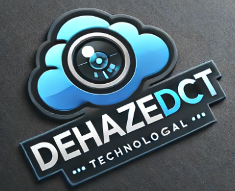

&nbsp;

  

&nbsp;

# Dehazing_R

This is the official PyTorch implementation of our dehazing method for NTIRE 2024 Dense and NonHomogeneous Dehazing Challenge
# Environment:

CUDA Version: 11.0

Python 3.8

# Dependencies:

torch==1.10.0

torchvision==0.9.0

pytorch_lightning=2.0.0

timm=0.6.12

mmcv-full==1.5.0

mmdet==2.28.1

opencv-python 

termcolor 

yacs 

yyaml 

scipy

kornia

einops

DCNv4

# Our saved Model
Download [our saved model for NTIRE 2024 Dense and NonHomogeneous Dehazing Challenge](https://drive.google.com/file/d/17cV2VeKXp2dFfMaTwdWTdfKqWQUs7g8f/view?usp=drive_link) and unzip it into the folder ./weights to reproduce our test result.

# How to reproduce our test result
Download above saved models

Run test.py and find results in the folder ./results. Please note the weight path in Line 41 of test.py and Line 19 of model.py.

Please note new generated results may have subtle varations with [our submitted test results](https://drive.google.com/file/d/18zyWybWFRbYA4HsifToUfLqPi_CnomsU/view?usp=sharing) due to the device difference, please feel free to choose our submitted results or your generated images for user study.

If you have any problems in reproducing our result, please contact wdong1745376@gmail.com as soon as possible.

